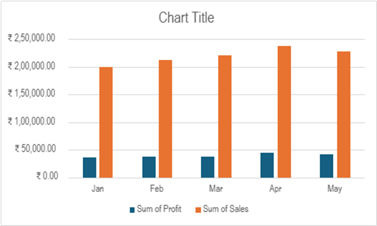

# sales-performance-analysis-excel
Excel-based Sales Performance Analysis project including KPI tracking, regional analysis, and profitability insights.
Objective: Analyze multi-category sales dataset to evaluate revenue growth, regional performance, and profitability trends.

Dataset Overview:
5 Months of Sales Data
5 Products
4 Regions
Total Revenue: ₹1.09M
Overall Profit Margin: 17.9%

Key Insights:
Total Revenue: ₹1.09M
Overall Profit Margin: 17.9%
Revenue grew 19% from Jan–Apr
Profit growth lagged behind sales growth
West region most efficient; South margin at risk

Tools Used:
1.Excel 365
2.Pivot Tables
3.SUMIFS
4.KPI Calculations
5.Line & Column Charts

Business Recommendations:
Focus on margin improvement in high-sales regions.
Protect top-performing revenue products.
Optimize pricing strategy for low-margin products.

